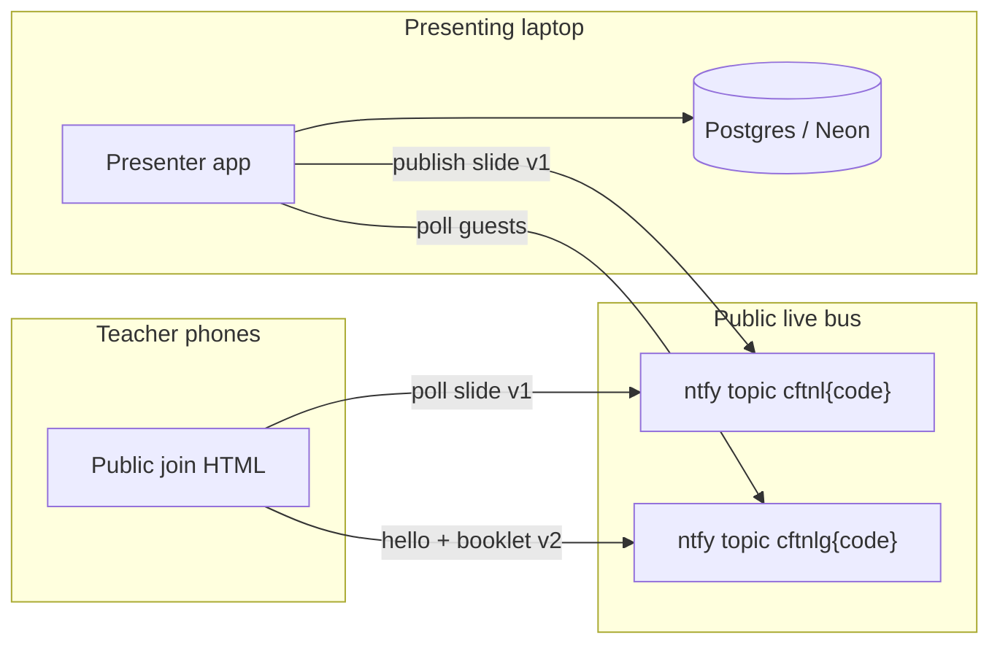

# ChatGPT for Teachers — Developer Recreation Spec

**Product name:** ChatGPT for Teachers  
**Edition:** v1.2 · Netherlands · live workshop  
**Audience of this document:** a software developer asked to recreate the product **exactly as it is now**.  
**Date of this snapshot:** 15 September 2026

This is not a pitch deck. It is the operating description of a working professional-development platform for teachers in Dutch schools.

---

## 1. What this product is

An independent professional-development desk for using **ChatGPT Free** in a school, with a **mandatory Netherlands / EU safe-and-legal core**.

It is:

- A **live workshop tool**. One presenter on a laptop. Teachers in the room follow on their own phones.
- A **curriculum**. 30 modules, five course lengths, a booklet, diagnostics, a prompt studio, a practice sandbox, a traffic-light clinic, and a certificate.
- A **presenter operations desk**. Each class gets its own 6-character code and QR. After the class, the presenter opens that date, sees who joined, reads and prints booklets, and prints certificates.

It is **not**:

- OpenAI-certified training.
- Legal advice.
- School approval of ChatGPT.
- A student-facing classroom app.
- A multiplayer game.

The operating assumption, printed on the product:

> ChatGPT may not yet be a school-approved tool. Training does not approve the tool, create a lawful basis, replace a DPIA or processing agreement, or override school policy. Do not put identifiable student, parent, colleague or safeguarding information into a personal or unapproved ChatGPT account.

Tagline:

> **Use ChatGPT like a teacher. Keep the teacher in control.**

Wordmark subtitle: **Netherlands · Safe · Legal**

---

## 2. What it is supposed to do

### For the presenter (typically a maths / PD lead)

1. Log in **only on the presenting laptop**.
2. Pick a course (default: the 1-hour maths department hour).
3. Open a **room**. The product allocates a unique 6-character code and a QR.
4. Project the join screen. Teachers scan. They type a name. They do not sign in.
5. Run the lesson. Next/Back on the laptop moves every phone to the same slide.
6. Keep **“Say this”** facilitator notes on the laptop only. Phones never see them.
7. Watch **On their phones** — names appear as people join; booklets arrive as they send.
8. End the class. That code is now a **past class** under that date.
9. Later: open Past classes → that code → who took part, how long, print booklets, print certificates.

Each class the presenter runs gets **its own QR / code**. Data is stored under that class, not under a shared eternal QR. Ten weeks later, a new room = a new code.

### For a teacher in the room (phone)

1. Scan the QR (or type the six-character code).
2. Type their name.
3. See the **same slide** the presenter is on — not the presenter’s teal console, not “Say this”.
4. Write in the **orange booklet under the slide**. It saves as they type.
5. At the end, send the booklet to the presenter (feeling + takeaway).
6. Optionally collect a named certificate.

### For a teacher working alone (after the session, or without a live room)

- Walk the modules, fill the booklet, run the diagnostic, use the prompt studio and practice sandbox, print the data-card, issue a certificate.

---

## 3. Two surfaces (non-negotiable)



| Surface | Who | Auth | Chrome | Booklet | Facilitator cue |
|---|---|---|---|---|---|
| Presenter app | Host on laptop | Required to open a room | **Teal** console | Collects others’ booklets | **“Say this”** visible |
| Public join page | Teachers on phones | **None** | **Amber** follow header, honey paper | **Under the slide** + full sheet | **Never shown** |

The QR **must not** point at a private preview, a sandbox, grok.me, or jsDelivr HTML. Those hosts either block the phone (“you don’t have access to this preview”) or serve HTML as `text/plain` so the page never runs.

**Canonical join URL:**

```
https://cft-nl-join.vercel.app/?c={CODE}
```

`CODE` is six characters, no space. Displayed on screen as `ABC DEF`.

---

## 4. Live class protocol

### 4.1 Class codes

Alphabet (no I, O, 0, 1 — they confuse a projector):

```
ABCDEFGHJKLMNPQRSTUVWXYZ23456789
```

```ts
normalizeCode(raw)  // uppercase, strip non-alphanumeric
displayCode(code)   // "L7SM9Y" → "L7S M9Y"
randomCode(6)       // crypto.getRandomValues against the alphabet
isValidCode(raw)    // normalize length === 6
```

The class **id is the code**. It is the primary key of `live_sessions`.

### 4.2 SQL class (signed-in world)

Used when the presenter (and any signed-in participant) is on the same deployed app + database.

Tables: see §9.

Server functions (`src/lib/server/live.ts`), all POST, auth-gated unless noted:

| Function | Auth | Behaviour |
|---|---|---|
| `peekLiveClass({ code })` | none | Peek a session. |
| `createLiveClass({ courseId, displayName })` | host | If this host already has a live room of the **same** course, reopen it. If they have a live room of a **different** course, end that one first. Else allocate a fresh code, insert host as `role=host`, enrol them, start at first module / slide 0. |
| `joinLiveClass({ code, displayName })` | user | Join as participant (or re-attach as host if they own it). |
| `getMyLiveClass()` | user | Current live membership + heartbeat `last_seen_at`. Online = seen < 45s. |
| `pullLivePosition()` | user | Lightweight `{ sessionId, moduleId, slide, role }`. Participants poll this every **300ms**. |
| `broadcastLivePosition({ code, moduleId, slide })` | host only | Writes `current_module_id` / `current_slide`. Slide clamped 0–80. |
| `endLiveClass(code)` | host only | `status=ended`, `ended_at=now()`. |
| `leaveLiveClass(code)` | participant | Host cannot leave — they must end. |
| `getMyEndedClass()` | user | Latest ended class this user attended as participant. |
| `getClassRoster({ code })` | host only | Members + diagnostic/workbook/completion rollup. |

A host may only have **one live class at a time**.

### 4.3 Public bus (phone world)

Phones never have the presenter’s database. Position and presence travel on **public ntfy** hosts:

```
https://ntfy.adminforge.de
https://ntfy.envs.net
https://ntfy.mzte.de
```

(`ntfy.sh` is **not** used — it rate-limits anonymous beacons.)

**Publish to all three; succeed if any one returns OK. Poll all three; use the first body that parses.**

Topics:

```
liveBusTopic(code)  = "cftnl"  + code.toLowerCase()   // e.g. cftnll7sm9y
liveGuestTopic(code)= "cftnlg" + code.toLowerCase()   // e.g. cftnlgl7sm9y
```

POST:

```
Content-Type: text/plain; charset=utf-8
Title: cft-live   (or cft-guest)
Cache: yes
body: JSON string
```

Poll:

```
GET {host}/{topic}/json?poll=1
Cache: no-store
```

ntfy returns JSONL. Each line has `{ event, message }` where `message` is the inner JSON string. Ignore non-`message` events. Take the payload with the greatest `at`.

#### Slide beacon — `LiveBusPayload` v1

```ts
{
  v: 1,
  code: string,          // 6-char
  courseId: CourseId,    // must be a known course
  title: string,
  moduleId: string | null,
  slide: number,         // 0-based index inside that module
  status: "live" | "ended",
  hostName: string,      // max 80
  at: number             // Date.now()
}
```

Host publishes:

- immediately when the room opens,
- on every slide / module change,
- every **2500ms** while live,
- once more with `status: "ended"` when the class closes.

Phones poll every **1200ms**. If the latest v1 is missing or `status==="ended"`, the class has closed.

The presenter app publishes **twice**: browser `publishLiveBusBrowser` and server `publishLiveBus` (auth). Either path is enough for phones.

#### Guest events — `GuestBusEvent` v2

```ts
{
  v: 2,
  kind: "hello" | "booklet",
  code: string,
  name: string,                    // trimmed, 2–80 chars
  answers?: Record<string, string>,
  feeling?: string,                // max 400 on bus
  takeaway?: string,
  at: number
}
```

Phone:

- `hello` on enter and every **6s** while joined.
- `booklet` when they tap Send booklet.

Presenter:

- `pullGuestRoom` / `pullGuestRoomBrowser` every **2500ms**.
- Collapse by `name.toLowerCase()`.
- `online` if `now - lastSeen < 20_000`.
- Merge into the live roster as members with `userId: "phone:{name.toLowerCase()}"`. Hosts and any signed-in (non-phone) members are kept.

This is how the header count goes from **1** (host only) to **host + phones**, and how **On their phones** fills.

### 4.4 FollowSync (in-app participants)

If `live.view && !live.isHost`:

- force `moduleSlide[moduleId] = currentSlide`
- navigate to `/modules/{slug}`
- hide Back/Next

Guests never pick a slide.

### 4.5 Join URL construction

```ts
PUBLIC_JOIN_PAGE = "https://cft-nl-join.vercel.app"
joinUrlFor(code) = `${PUBLIC_JOIN_PAGE}/?c=${normalizeCode(code)}`
```

Never use `window.location.origin` for the QR. Sandbox / private preview hosts must never appear in a QR.

Treat a join URL as gated (do not use it) if the host is:

- `*.grok-sandbox.com`
- `grok.me` / `*.grok.me`
- `*jsdelivr.net`

---

## 5. Public join page (phones)

Standalone file: `docs/index.html` (~27KB). **No React.** Deployed as a Vercel static site (project name `cft-nl-join`).

`docs/vercel.json`:

```json
{
  "cleanUrls": true,
  "headers": [{ "source": "/(.*)", "headers": [{ "key": "Cache-Control", "value": "public, max-age=0, must-revalidate" }] }]
}
```

`docs/404.html` immediately `location.replace("/" + location.search + location.hash)` so `/?c=CODE` survives unknown paths.

### 5.1 Content pack

Tried in order, each with `?v=Date.now()`:

1. same-origin `hour.json` (modules 24–30)
2. same-origin `content.json` (all 30)
3. jsDelivr `…/docs/hour.json`
4. jsDelivr `…/docs/content.json`

jsDelivr JSON is fine (`application/json`). **jsDelivr HTML is not** (`text/plain` + nosniff) — never point the QR at jsDelivr HTML.

Built by `scripts/build-join-pack.ts` from the TypeScript curriculum + `viewOf(slide)` + booklet step for that module.

Pack shape:

```ts
{
  courses: [{ id, title, moduleIds }],
  modules: [{
    id, slug, title,
    booklet: null | { id, n, title, lead, fields: [{ id, label, placeholder, multiline }] },
    slides: [ /* SlideViewModel fields, plus example, remember */ ]
  }]
}
```

If the live course has no `moduleIds`, fall back to modules with `Number(id) >= 24` (the maths hour).

### 5.2 Phone flow

1. Read `?c=`. Restore name from `sessionStorage["cft-guest-name"]`. Restore answers from `localStorage["cft-booklet"]`.
2. Load pack. Fail → “Could not load the lesson.”
3. Join form (amber full-bleed): name (required ≥ 2), optional code field if `?c` missing.
4. `pullLive()`. If no v1 live payload → “That code is not live yet. Wait for the presenter to open the room, then try again.”
5. Persist name. `hello()`. Render stage.
6. Tick: pull live every 1200ms; hello every 6s.
7. On module/slide change, reset local `checked` ticks (the tickable items on the slide), keep booklet answers.

Copy on the join card:

> Type your name. You will see the same slide as the room, with the booklet underneath.  
> Use your own phone — not the presenting laptop. No sign-in.

### 5.3 Phone stage (must match the in-app follower, not the presenter)

- Header **amber** `#c44e10` on paper text: `Following {CODE} · {name}` + Booklet button with filled count.
- Banner: “The presenter moves the slides. Write in the booklet under this slide.”
- White slide card, kind-coloured bar, title, activity kicker, lead, items, steps, avoid/aim.
- **Booklet block under the slide** (lined amber paper): “Your booklet · write on this page”, current step fields.
- Sticky amber footer: `Slide {i+1} of N` + **Send booklet**.
- **No Back/Next. No “Say this”. No teal console.**

Item glyphs:

- `item.n === "check"` or empty → `1, 2, 3…` (**never** the word “check”)
- `green*` → `G`, `amber*` → `A`, `red*` → `R`
- otherwise the stored `n`
- checked → `✓`

Avoid/aim cards: default labels **Risky habit** / **Professional habit** if missing. Do **not** also dump those labels as body paragraphs.

Full booklet sheet: every unique booklet step for the course, then “How was this hour?” with `review-feeling` and `review-takeaway`. Send fires a v2 `booklet` event. Success: “Booklet sent. You can update it.”

---

## 6. Design system

Five colour families. No extra accents.

| Token | Hex | Use |
|---|---|---|
| paper | `#f6edd8` | Page background (honey) |
| ink | `#13241f` | Body text |
| ink-soft | `#2c4039` | Secondary text |
| muted | `#5a6d66` | Kickers, hints |
| surface | `#fffaf0` | Cards |
| elevated | `#ffffff` | Slide card |
| line | `#ead9b6` | Borders |
| line-strong | `#d4bc86` | Strong hairline |
| accent / teal | `#0c6e66` | Presenter, primary buttons, teach bars |
| accent-fg | `#f4f7f4` | Text on teal |
| accent-soft | `#d3efe9` | Item chips |
| amber | `#c44e10` | Participant / live / booklet |
| amber-bg | `#ffe0c2` | Booklet paper |
| green | `#1a7a46` | Aim / Green light / lens bars |
| green-bg | `#d6f0e0` | Aim cards |
| red | `#c4332a` | Avoid / Red light / avoid-aim bars |
| red-bg | `#fde0da` | Avoid cards |

Fonts:

- Display: **Fraunces** (opsz 9..144, weights 460 / 520 / 600)
- Body: **Source Sans 3** (400 / 500 / 600)
- Mono: IBM Plex Mono (codes)

Headings: weight 520, letter-spacing `-0.03em`, line-height 1.15.

Radii: 4 / 8 / 12 / 18 / 26. Default 12.

Shadow:

```
0 0 0 1px rgba(27,25,20,0.06),
0 1px 2px -1px rgba(27,25,20,0.06),
0 2px 6px 0px rgba(27,25,20,0.04)
```

Kind bars on slides:

| kind | bar | kicker | activity |
|---|---|---|---|
| teach | teal | Together | Listen with the room — tick a point as you take it in. |
| hands-on | amber | Your turn | Do this on your device. Write the answers in your booklet. |
| avoid-aim | red | Draw the line | Name the boundary. What stays with the teacher? |
| step | teal | The move | Follow the sequence. This is the move you will reuse. |
| lens | green | Talk this through | Talk with the person next to you. Then tick what you checked. |

Presenter stage well: teal mixed toward ink.  
Follower stage well: amber mixed toward ink.

Brand mark: 32×32 rounded square, teal field, paper open-book path (or inverted on teal/amber). Theme color / OG colour: `0c6e66`.

Mobile: 48px minimum tap targets, no horizontal overflow at ~390px, booklet usable with one thumb.

---

## 7. Information architecture

### 7.1 Home `/`

Two doors.

- **I’m presenting today** (paper card on teal hero) → `/login?next=/class` or `/class` if already signed in.
- **I’m in this session** (amber card) → `/join`.

Kicker: `v1.2 · Netherlands · live workshop`.

Footer: “Not OpenAI certified. Not legal advice. Not school approval.”

### 7.2 Auth `/login`

Search `{ next?: string }`. Open-redirect safe: must start with `/`, must not start with `//` or contain `://`; else `/class`.

Presenter next (`/class`, `/log…`): teal banner “Presenter login · use this account only on the presenting laptop”.

Otherwise: amber banner “Participant sign-in · keep this account off the presenting laptop”.

Allowlisted continue targets: `/class`, `/log`, `/log/:code`, `/workbook`, `/join/:code`, `/modules/:id`, else `/desk`.

Email/password is **on** (`src/lib/auth/email-password.ts` → `emailAndPasswordEnabled = true`) in addition to the platform Grok gate. Do not rewrite the rest of `src/lib/auth/` except that flag.

Hard auth gates in the UI: **`/class` and `/log*` only**. Phones on the public join page never hit these.

### 7.3 Presenter room `/class`

Signed-in required.

Idle: pick a course (default `math-hour`) → **Open the room** → `createLiveClass` → show join overlay → navigate to first module.

Host room:

- Giant code + QR (`joinUrlFor`)
- **Project join screen**
- People count (`{online} live`)
- **Jump the room** to the current module
- **On their phones** (`PhoneRoom`)
- **Booklets sent to you**
- **End this class**

If this laptop is already a participant of a live class, bounce them to the current module (they should not present from a phone).

### 7.4 Lesson `/modules/$moduleId`

`WorkshopStage`. Three chrome modes:

**Presenting (host):**

- Teal header: live-dot, `Presenting {CODE}`, module title.
- Buttons: Home, people count, **Room QR**, Hide/Show cue, account.
- Strip: “Next slide moves every phone. ‘Say this’ is under the slide — hide it if you project this window.”
- Facilitator notes (`slide.notes`) labelled “Only on this laptop — the room’s phones do not see this”.
- Keyboard: ← → Space PageUp/Down.
- Footer teal: Back · `{i+1} of N` · Next. Last module last slide: **Collect booklets**.
- **No booklet, no WriteHere, no SubmitPack** on the host stage.

**Following (locked guest):**

- Amber header: “Following the presenter” + Booklet.
- Banner: “The presenter moves the slides. Write in the orange booklet under this slide.”
- `WriteHere` under every slide.
- Last slide of last module also shows `SubmitPack` (in-app signed-in guests).
- Footer amber: slide count + **Send booklet**. **No Back/Next.**

**Solo (not live):** paper header, local Back/Next, booklet toggle. Last: **Finish**.

Home button on the presenter stage returns to `/desk` (and the room stays live).

### 7.5 Other routes

| Path | Purpose |
|---|---|
| `/desk` | After login home. Two doors, or “stay on the lesson” when live. |
| `/join` | Type the code. |
| `/join/$code` | In-app guest join (fallback). Name → `joinAsGuest` via the public bus. |
| `/workbook` | Full booklet for the enrolled course. |
| `/log` | Past classes list (presenter inbox). |
| `/log/$code` | One class: members, booklets, print booklet / certificate / all. |
| `/certificate` | Named certificate of completion. |
| `/closed` | Guest lock after the presenter ends. |
| `/courses`, `/courses/$courseId` | Pick / enrol in a course length. |
| `/modules` | Curriculum index. |
| `/legal` | Safe & legal handbook. |
| `/governance` | School implementation. |
| `/studio` | SCOPE-V builder + prompt library. |
| `/practice` | Training sandbox (xAI). Hard Green-data checkbox + PII scan. |
| `/diagnostic` | PRE/POST 1–5, 12 items. |
| `/data-card` | Printable Green/Amber/Red + clinic scenarios. |

Shell nav:

- Host live: Home, Lesson, Room, Past classes
- Participant live: Lesson, Booklet
- Idle: Home, Presenter, Join, Past classes

On a module stage path the chrome is stripped (no sidebar) so the slide can be projected.

### 7.6 End of class

Confirm: “End this class and lock the slides?”  
Publish bus `status: "ended"`. `endLiveClass`. Navigate to `/log/{code}`.  
`CourseLock` then sends in-app guests who try to stay on slides to `/closed`.

---

## 8. Curriculum

### 8.1 Slide model

```ts
type Strand = "foundations" | "practice" | "legal" | "capstone";
type SlideKind = "teach" | "hands-on" | "avoid-aim" | "step" | "lens";

type SlideItem = { n: string; title: string; body: string };

type Slide = {
  kind: SlideKind;
  title: string;
  paras: string[];
  items: SlideItem[];
  avoid: string;
  aim: string;
  lens: string;
  notes: string;      // presenter only
  duration: string;   // e.g. "3 min"
};

type CourseModule = {
  id: string;         // "01"…"30"
  slug: string;
  title: string;
  blurb: string;
  strand: Strand;
  duration: string;
  slides: Slide[];
};
```

`viewOf(slide)` in `slide-view.ts` derives the display model: kicker, activity, lead, numbered steps, avoid/aim split, prompt extraction from quoted lens, path (`→` splits), warning (“No real student…”), journey flag (≥6 items).

**Renderer rules the old dump page broke:**

- Never print `item.n` when it is the literal `"check"` — use the 1-based index.
- For `avoid-aim`, do not also render the avoid/aim paragraphs in the body. Use the two Side cards.
- Cap displayed paras when items/steps exist (max 2 extra).

### 8.2 Courses

```ts
type CourseId = "math-hour" | "essentials" | "half-day" | "full-day" | "multi";
```

| id | Title | Duration | Modules (order) |
|---|---|---|---|
| math-hour | 1-hour ChatGPT for maths | 60 min | 24, 25, 26, 27, 28, 29, 30 |
| essentials | 2-hour AI Essentials | 120 min | 01, 02, 03, 04, 07, 05, 06, 09, 14, 15, 17, 12, 22, 23 |
| half-day | Half-day workshop | 3h 30 | 01–04, 07, 19, 05, 06, 08, 09, 11, 20, 21, 13–17, 12, 18, 22, 23 |
| full-day | Full-day programme | 6h | nearly all of 01–23 (coverage: full) |
| multi | Multi-session · 6 × 2 hours | 12h | 01–23 spread across six sessions |

Default when opening a room: **`math-hour`**.

### 8.3 Modules 01–23 (master curriculum)

| id | slug | strand | dur | slides | title |
|---|---|---|---|---|---|
| 01 | orientation | foundations | 25 | 3 | Orientation, baseline & mindset |
| 02 | ai-literacy | foundations | 30 | 5 | AI literacy foundations |
| 03 | how-it-works | foundations | 25 | 5 | How ChatGPT works — and fails |
| 04 | setup-privacy | foundations | 35 | 6 | Setup, privacy & account choices |
| 05 | scope-v | practice | 35 | 7 | SCOPE-V prompting fundamentals |
| 06 | verification | practice | 30 | 4 | Verification & hallucination control |
| 07 | lesson-planning | practice | 30 | 4 | AI-assisted lesson planning |
| 08 | differentiation | practice | 30 | 3 | Differentiation, inclusion & support |
| 09 | resource-creation | practice | 35 | 8 | Resource creation studio |
| 10 | assessment | practice | 30 | 6 | Assessment design in the AI age |
| 11 | feedback | practice | 25 | 5 | Feedback & marking support |
| 12 | student-literacy | practice | 30 | 6 | Teaching students AI literacy |
| 13 | integrity | legal | 30 | 4 | Academic integrity & misuse |
| 14 | avg-gdpr | legal | 40 | 9 | AVG / GDPR & school data protection |
| 15 | ai-act | legal | 40 | 8 | EU AI Act — risk-based school use |
| 16 | bias-fairness | legal | 25 | 3 | Bias, fairness, accessibility |
| 17 | safeguarding | legal | 30 | 5 | Safeguarding, pastoral & wellbeing |
| 18 | communication | practice | 25 | 5 | Parents, colleagues & leaders |
| 19 | research-policy | practice | 25 | 10 | Research, curriculum & policy |
| 20 | multimodal | practice | 25 | 4 | Multimodal AI — images, audio, data |
| 21 | plugins-gpts | practice | 30 | 17 | Plugins, apps, GPTs & workflows |
| 22 | governance | legal | 35 | 12 | School implementation & AI policy |
| 23 | capstone | capstone | 40 | 14 | Capstone & completion |

Exact slide bodies: `source/src/lib/content/modules.ts`. Do not paraphrase.

### 8.4 Modules 24–30 — 1-hour maths department

Exact slide bodies: `source/src/lib/content/math-hour.ts`. Appended onto `modules` as `...mathHourModules`.

| id | slug | dur | title | slides (in order) |
|---|---|---|---|---|
| 24 | maths-use | 7 | How to use it correctly | This hour is for the maths desk · A pattern machine — not a mathematician · Why fluent maths can still be wrong · One workflow this week |
| 25 | maths-for | 7 | What it is for — and not for | What ChatGPT is actually for in maths · What it is not for · Draw the line at the maths desk · Talk this through — would you use it? |
| 26 | maths-safety | 10 | Safety at the maths desk | Green, amber and red at the maths desk · What never goes in — maths examples · Five questions before every prompt · Classify these maths-desk examples · Training is not permission |
| 27 | maths-files | 8 | Uploading documents | Why files beat a long chat · Create your first teaching project · Add knowledge: files on Free · What belongs — and what must never be stored · Name the three files you would add |
| 28 | maths-make | 10 | Creating documents | Drafts you can actually use this week · Brief it with SCOPE-V · Differentiation is not ‘make it easy’ · Make one retrieval starter · Every line of maths is yours |
| 29 | maths-images | 8 | Images and diagrams | Generated images versus mathematical figures · Never trust a generated graph · When a screenshot is better than a drawing · The image habit |
| 30 | maths-close | 10 | Department agreement and close | What we agree as a department · What I will try — and what I will not · First 30 days at the maths desk · Send your booklet to the presenter |

Pedagogical spine of the hour (do not drop these claims):

- Pattern machine, not a mathematician.
- Teacher owns every line of maths.
- Green / Amber / Red with maths examples. Unpublished tests and named students stay out.
- One Project per unit. Free: five-file cap. Never student work.
- SCOPE-V briefs. Differentiation keeps the objective.
- Generated pictures are decoration. Graphs come from Desmos, GeoGebra or the GDC.

### 8.5 Booklet

Workbook steps live in `workbook.ts`. Mapping module → step lives in `path.ts` `workbookModuleIds`.

**Hour booklet (phones in a maths hour):**

| step id | n | title | fields |
|---|---|---|---|
| hour-open | 01 | One workflow this week | `hour-workflow`, `hour-risk` |
| hour-for | 02 | For / not for at my desk | `hour-for`, `hour-not-for` |
| hour-safety | 03 | Classify a planned use | `hour-classify`, `hour-minimise` |
| hour-files | 04 | Files for this unit | `hour-project`, `hour-belong`, `hour-never-file` |
| hour-make | 05 | A resource I will draft | `hour-brief`, `hour-kept` |
| hour-images | 06 | Images versus figures | `hour-image-yes`, `hour-image-no` |
| hour-close | 07 | Department agreement | `hour-try`, `hour-wont` |

Plus close-of-hour review on the public page: `review-feeling`, `review-takeaway`.

In-app `SubmitPack` also collects `improvement` and a 1–5 `rating` (signed-in users only). Hosts cannot send a booklet to themselves.

Full-programme booklet steps: `open`, `what`, `setup`, `personalise`, `organise`, `build`, `instructions`, `knowledge`, `prompt`, `resource`, `tools`, `tasks`, `safely`, `capstone`.

Capstone checks and 30-day plan are in `workbook.ts` (`capstoneChecks`, `thirtyDays`).

### 8.6 Other content

- **SCOPE-V letters:** Situation, Constraints, Output, Persona, Examples, Verification. Field copy in `prompts.ts` `scopeVFields`.
- **Prompt library (16):** `scope-v-master`, `project-instructions`, `red-team`, `classroom-resource`, `differentiation`, `feedback-stems`, `verify-claims`, `source-hierarchy`, `final-qa`, `parent-email`, `anonymisation-test`, `connector-check`, `scheduled-task`, `refuse-grade`, `refuse-safeguarding`, `refuse-emotion`.
- **Diagnostic (12, scale 1–5):** confidence, authority, traffic, approval, scopev, verify, human, avg, aiact, safeguarding, detectors, students. Labels: `1 — not yet` … `5 — secure`.
- **Clinic scenarios (8):** retrieval (green), spreadsheet (red), parent-email (amber), detector (red), policy-compare (green), hockey (red), safeguarding (red), generic-fractions (green).
- **Legal chapters:** personal-data, approval, avg, ai-act, emotion, assessment, safeguarding, incidents, students, normenkader.
- **Traffic lights, five questions, Stop / Substitute / Escalate:** `legal.ts`.
- **Practice sandbox system prompt:** `src/lib/ai/practice.ts`. Model `grok-4.5`, temperature 0.4, max 900 tokens, refuse personal data.
- **PII scan:** email, NL phone, SEN/safeguarding/grade/BSN words, given-name + class group. `src/lib/pii.ts`.
- **Slide images** in `public/slides/`: add-files.png, memory-settings.jpg, new-project.png, project-settings.png, project-structure.jpg, scheduled-tasks.jpg, web-search.jpg. Wired via `slide-visuals.ts` / `slide-enrichment.ts` by slide title.

---

## 9. Data model

### 9.1 SQL

**Better Auth** (`migrations/0001_auth.sql`) — do not hand-edit. Tables `"user"`, `"session"`, `"account"`, `"verification"` with camelCase quoted columns.

**Live classes** (`0002_live_class.sql`):

```sql
live_sessions (
  id text primary key,            -- the 6-char code
  host_user_id text not null,
  course_id text not null,
  title text not null default '',
  status text not null default 'live',   -- live | ended
  current_module_id text,
  current_slide integer not null default 0,
  created_at timestamptz not null default now(),
  ended_at timestamptz
);

session_members (
  session_id text not null,
  user_id text not null,
  display_name text not null default '',
  role text not null default 'participant',  -- host | participant
  joined_at timestamptz not null default now(),
  last_seen_at timestamptz not null default now(),
  primary key (session_id, user_id)
);

user_progress (
  user_id text primary key,
  enrolled_course_id text,
  completed_modules text not null default '[]',     -- JSON
  module_slide text not null default '{}',
  diagnostic text not null default '{}',
  diagnostic_submitted text not null default '{}',
  workbook text not null default '{}',
  capstone_ticks text not null default '{}',
  bookmarked_prompts text not null default '[]',
  practice_history text not null default '[]',
  clinic text not null default '[]',
  certificate_name text not null default '',
  certificate_role text not null default 'Teacher',
  certificate_school text not null default '',
  certificate_issued_at text,
  updated_at timestamptz not null default now()
);
```

**Booklets** (`0003_booklet_submissions.sql`):

```sql
booklet_submissions (
  id text primary key,
  session_id text not null,
  course_id text not null,
  user_id text not null,
  display_name text not null default '',
  workbook text not null default '{}',
  capstone_ticks text not null default '{}',
  diagnostic text not null default '{}',
  feeling text not null default '',
  improvement text not null default '',
  takeaway text not null default '',
  rating integer,
  submitted_at timestamptz not null default now(),
  unique (session_id, user_id)
);
```

Phone guests **do not** write SQL. Their booklets live on the guest bus until the presenter reads them in PhoneRoom. Signed-in in-app participants upsert via `submitBooklet`.

`user_id` is TEXT (Better Auth id), never UUID. Every SQL mutation that is not a public peek is scoped by `authMiddleware` → `context.userId`. Never trust a client-sent user id.

### 9.2 Client store (zustand persist)

Key: local progress + `liveSessionCode` + `followPresenter` (default true).

Shape: `ProgressSnapshot` in `progress-types.ts`. Signed-in users also sync via `loadProgress` / `saveProgress` (`src/lib/server/progress.ts`). Workbook values clipped to 8,000 chars, max 48 fields.

Privacy banner: `localStorage["cft-privacy-ok-v1"] = "1"`. Guest name: `sessionStorage["cft-guest-name"]`. Phone booklet: `localStorage["cft-booklet"]`.

Display names: never show a raw email. `prettyPersonName` / `cleanName` — if the string contains `@`, store `"Participant"`.

---

## 10. Feature inventory (must exist)

1. Presenter login / logout, laptop-remembered session.
2. Course picker with five lengths; default 1-hour maths.
3. Open room → unique code + QR on the public join origin.
4. Projector join overlay (“Scan to join this class”).
5. Presenter stage with “Say this”, Home, Room QR, people count, Next/Back.
6. Phone stage: same slide, amber chrome, booklet under the slide, Send booklet.
7. Follow-along that actually moves when the presenter taps Next.
8. On their phones roster (name, Following / Booklet in / Left).
9. Past classes by date/code; print booklet; print certificate; print all.
10. End class locks slides.
11. Full booklet, diagnostic PRE/POST, data-card, legal handbook, governance, studio, practice sandbox, certificate.
12. Privacy first-run dialog. No student names in notes.
13. Cookie / essential-sign-in explanation.
14. Green / Amber / Red clinic.
15. PII scan before practice.
16. Mobile + laptop layouts.

---

## 11. Stack (current implementation)

| Layer | Choice |
|---|---|
| App framework | TanStack Start + TanStack Router (file routes), React 19 |
| Bundler | Vite 8 |
| Styling | Tailwind v4, tokens in `src/styles.css` `@theme` |
| Auth | Better Auth. Email/password enabled. Platform Grok gate also present. |
| Database | Neon (deployed) / PGLite (local). Kysely / tagged SQL via `@/lib/db`. |
| Client state | zustand + persist |
| QR | `uqr` |
| Live bus | ntfy (adminforge, envs.net, mzte.de) |
| Practice AI | xAI `grok-4.5` via `XAI_API_KEY` (server only) |
| Phone site | Static HTML on Vercel, project `cft-nl-join` |
| Content mirror | GitHub `ManoliMeletiou/chatgpt-for-teachers` + jsDelivr JSON |

Router contract: named `export function getRouter()` in `src/router.tsx`. Root wraps `AuthProvider` → `LiveClassProvider` → `ProgressSync` + outlet + `PrivacyBanner`.

---

## 12. How to recreate it

### 12.1 Fastest faithful rebuild

1. Copy `source/` from this pack into a TanStack Start app with the same route file names.
2. Keep the design tokens and font loading from `src/styles.css` and `__root.tsx`.
3. Run SQL migrations 0001–0003.
4. Point `PUBLIC_JOIN_PAGE` at a **public** HTTPS static host.
5. Deploy `docs/index.html` + `hour.json` + `content.json` + `404.html` + `vercel.json` to that host as **text/html**.
6. Confirm `joinUrlFor` always uses that host, never the presenter origin.
7. Confirm ntfy publish/poll works from both the presenter browser and the phone page.
8. Run §16.

### 12.2 If you rebuild in another stack

Preserve, in this order of importance:

1. The two-surface UX contract (teal presenter / amber phone / booklet under slide / no cue on phones).
2. The live bus payloads and topic names (so a running room and a rebuilt phone page still talk).
3. The curriculum text (teachers have already seen these slides).
4. The booklet field ids (so saved answers still map).
5. The five course ids.
6. The colour tokens and Fraunces / Source Sans 3 pairing.

You may change the web framework. You may not change the phone protocol or the maths-hour copy.

### 12.3 Deploy rules that have already bitten this product

- A private preview origin will show teachers “you don’t have access to this preview.”
- jsDelivr serves `docs/index.html` as `text/plain` with `X-Content-Type-Options: nosniff`. Phones will not execute it.
- A Vercel **production** deploy on a Hobby team can 403; a **preview** alias `cft-nl-join.vercel.app` is the public HTML host in the current setup.
- Replacing a Vercel deployment **replaces the whole tree**. Always upload `index.html` with every deploy.
- ntfy.sh 429s. Use the three alternate hosts.
- Host SQL and phone guests are different worlds. Counting only SQL members shows **1** (the presenter). Merge the guest bus.

---

## 13. Copy you must not invent

Use these strings as they stand:

- “Use ChatGPT like a teacher. Keep the teacher in control.”
- “Scan to join this class.”
- “Teachers scan this code on their own phone. They see the same slide you are on, with the booklet underneath. They do not sign in.”
- “Following the presenter”
- “The presenter moves the slides. Write in the orange booklet under this slide.”
- “Only on this laptop — the room’s phones do not see this”
- “On their phones”
- “When a teacher scans the QR and types their name, they appear here.”
- “Your booklet · write on this page”
- “Say this” / “Hide cue” / “Show cue”
- “Training is not permission”
- “A pattern machine — not a mathematician.”
- “Generated pictures are decoration.”
- “Not OpenAI certified. Not legal advice. Not school approval.”
- Certificate: “Certificate of completion” / “This is to certify that” / “Independent professional development. Not OpenAI certification, not legal advice, and not school approval.”

---

## 14. Certificate

A4-ish paper sheet, 10px teal border, corner marks.

- Title: Certificate of completion
- “This is to certify that”
- Participant name (from certificate fields or booklet display name)
- Course title
- Role (default “Teacher”) and school
- Issued date (`en-GB`)
- Disclaimer as above

Print via `window.print()` from `/certificate` and from `/log/$code` (per person or all).

---

## 15. Privacy, cookies, safety

- First visit: modal “How this desk keeps your work.” Essential cookie for sign-in. Booklet saved so the presenter can collect it. “Do not put student names in the notes.” Button: **Understood**.
- Training activities always include “No real student personal data”.
- Practice sandbox refuses identifiable / SEN / safeguarding / grading prompts.
- Display names strip emails.
- Public join page: `robots: noindex`.

---

## 16. Acceptance tests (recreate is not done until these pass)

### Projector + phones (the session that failed in screenshots)

1. Presenter logs in on a laptop, picks **1-hour ChatGPT for maths**, opens the room.
2. QR encodes `https://cft-nl-join.vercel.app/?c=XXXXXX` (or the rebuilt public origin). A phone that is **not** on the presenter’s network can open it without a login wall.
3. Phone: amber name form, then the **same module 24 slide** as the laptop, white card, kind bar, **no “Say this”**, **no overlapping word “check”**.
4. Booklet is visible **under the slide** with real fields (“One maths workflow…”, not a generic textarea).
5. Presenter taps Next. Within ~2 seconds the phone moves. Count of phones on the laptop becomes **host + N**, not 0 / 1.
6. Phone sends booklet. Presenter sees the name under **On their phones** with “Booklet in” and can read the answers.
7. Presenter can go Home without killing the room, reopen Room QR, and End class. Past classes shows that date, that course, those names.
8. A second class later allocates a **different** code.

### Visual contract

- Presenter: teal `#0c6e66`. Phone: amber `#c44e10` header, paper `#f6edd8` body.
- Avoid/aim is two cards (Risky habit / Professional habit), not duplicated paragraphs.
- `item.n === "check"` renders as 1, 2, 3.

### Solo desk

- Diagnostic, legal, studio, data-card, certificate all render and print.
- Typecheck and production build pass.

---

## 17. What “done” looks like in a department meeting

The presenter projects the teal join screen. Twenty maths teachers scan. Each phone shows the honey page, the current slide, and a booklet. The presenter talks from “Say this”. Next moves the room. At minute 60 they send booklets. After the meeting the presenter opens that date and prints the pack.

If any of those sentences is false, the rebuild is not the product.
